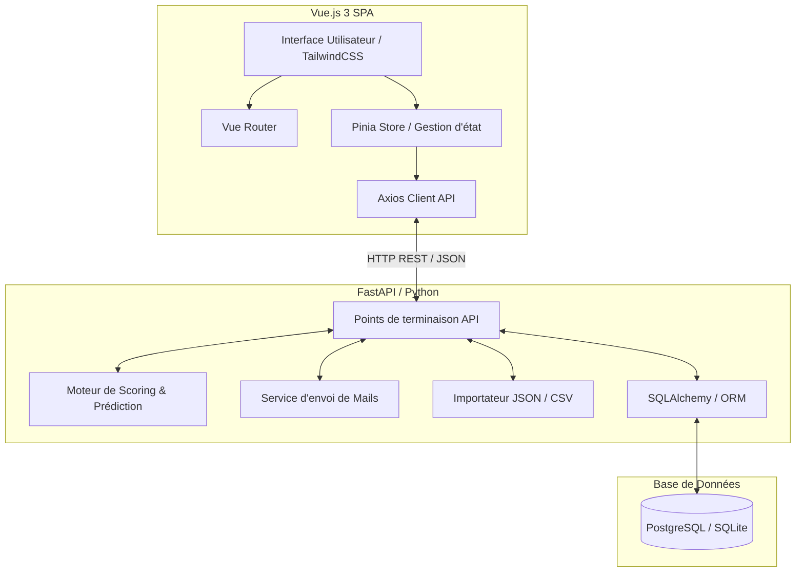
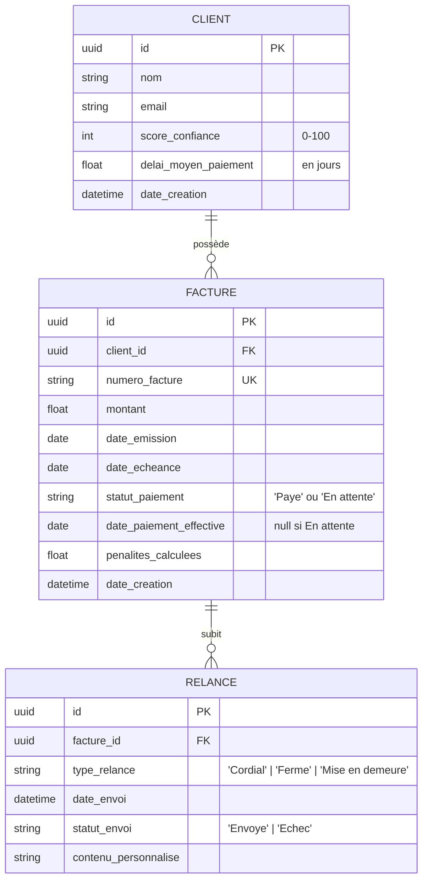

# Architecture & Spécifications Techniques - MVP RelanceFacture

Ce document présente l'architecture logicielle, le schéma de base de données, l'algorithme de scoring prédictif et la structure de l'interface utilisateur pour le MVP de gestion et de prédiction des impayés de factures.

---

## 1. Architecture Globale de l'Application

L'architecture est conçue pour être simple, évolutive et facile à déployer sous forme de MVP, en séparant la logique métier (Backend), la présentation (Frontend) et la persistance des données.



### Choix Technologiques Proposés

1. **Frontend : Vue.js 3 (Composition API) + Vite**
   - **Pourquoi** : Excellentes performances, courbe d'apprentissage rapide, structure de composants réutilisables. L'utilisation de Vite garantit des temps de build rapides.
   - **Styling** : CSS personnalisé ou TailwindCSS pour une interface moderne et responsive.

2. **Backend : FastAPI (Python)**
   - **Pourquoi** : Typage statique avec Pydantic, documentation OpenAPI auto-générée, et utilisation de Python qui facilite l'implémentation de la logique de calcul de scores ainsi que l'évolution vers du Machine Learning (e.g. Scikit-learn) si nécessaire.

3. **Base de Données : PostgreSQL (ou SQLite pour le développement local)**
   - **Pourquoi** : PostgreSQL assure la cohérence des données financières grâce aux transactions ACID, gère nativement le format JSON pour l'import de données complexes, et s'intègre parfaitement avec SQLAlchemy.

---

## 2. Schéma de la Base de Données (Relationnel)

Le schéma ci-dessous structure les données nécessaires au suivi des factures, au calcul du score des clients, et à l'historique des relances.



### Modèles de Données (Pydantic / TypeScript)

#### Représentation d'une facture pour l'importation (JSON / CSV)
```json
{
  "id_facture": "FAC-2026-0001",
  "nom_client": "Entreprise ACME",
  "email_client": "compta@acme.com",
  "montant": 1500.00,
  "date_emission": "2026-05-01",
  "date_echeance": "2026-05-31",
  "statut_paiement": "En attente",
  "historique_paiements_passes": [
    { "date_echeance": "2026-01-31", "date_paiement_effective": "2026-02-05" },
    { "date_echeance": "2026-02-28", "date_paiement_effective": "2026-02-27" },
    { "date_echeance": "2026-03-31", "date_paiement_effective": "2026-04-10" }
  ]
}
```

---

## 3. Logique & Algorithme de Calcul du Score de Confiance

Le score de confiance d'un client (sur une échelle de 0 à 100) est déterminé en combinant son taux de retard historique, la gravité (nombre de jours) de ses retards passés, et sa tendance récente.

### Paramètres de l'algorithme
- **Poids de l'historique global** : 60%
- **Poids de la tendance récente (3 dernières factures)** : 40%
- **Indemnité forfaitaire légale** : 40 € (Article L441-10 du Code de commerce français).
- **Pénalités de retard** : Calculées sur la base de 3 fois le taux d'intérêt légal ou du taux Refi de la BCE majoré de 10 points.

### Pseudo-code du Calcul du Score

```typescript
interface PaiementPasse {
  date_echeance: Date;
  date_paiement_effective: Date;
}

interface ClientData {
  historique: PaiementPasse[];
}

function calculerScoreClient(client: ClientData): { score: number; delaiMoyen: number } {
  const historique = client.historique;
  
  if (historique.length === 0) {
    return { score: 100, delaiMoyen: 0 }; // Score par défaut pour un nouveau client
  }

  let sommeRetardsGlobale = 0;
  let facturesEnRetardGlobal = 0;

  // Calcul du retard pour chaque facture en jours
  const retardsEnJours = historique.map(p => {
    const diffTime = p.date_paiement_effective.getTime() - p.date_echeance.getTime();
    const diffDays = Math.ceil(diffTime / (1000 * 60 * 60 * 24));
    return diffDays > 0 ? diffDays : 0;
  });

  const totalFactures = historique.length;
  const totalJoursRetard = retardsEnJours.reduce((sum, val) => sum + val, 0);
  const delaiMoyenPaiement = totalJoursRetard / totalFactures;

  // 1. Calcul de la pénalité historique globale (Base : 60 points)
  // Plus le délai moyen est élevé, plus le score baisse.
  let scoreHistorique = 100;
  if (delaiMoyenPaiement > 0) {
    if (delaiMoyenPaiement <= 3) scoreHistorique = 90;
    else if (delaiMoyenPaiement <= 10) scoreHistorique = 70;
    else if (delaiMoyenPaiement <= 30) scoreHistorique = 40;
    else scoreHistorique = 10;
  }
  
  // Ajustement selon le ratio de factures payées en retard
  const facturesEnRetard = retardsEnJours.filter(r => r > 0).length;
  const ratioRetard = facturesEnRetard / totalFactures;
  scoreHistorique = scoreHistorique * (1 - ratioRetard * 0.5); // Réduction de max 50% du score historique si 100% de retards

  // 2. Calcul de la tendance récente (Base : 40 points)
  // Analyse des 3 dernières factures payées
  const facturesRecentes = retardsEnJours.slice(-3);
  let scoreTendance = 100;
  
  if (facturesRecentes.length > 0) {
    const retardMoyenRecent = facturesRecentes.reduce((sum, val) => sum + val, 0) / facturesRecentes.length;
    if (retardMoyenRecent > delaiMoyenPaiement) {
      // La situation se détériore
      scoreTendance = Math.max(0, 100 - (retardMoyenRecent - delaiMoyenPaiement) * 5 - 20);
    } else if (retardMoyenRecent < delaiMoyenPaiement && retardMoyenRecent === 0) {
      // Amélioration nette (aucun retard récent)
      scoreTendance = 100;
    } else {
      scoreTendance = Math.min(100, 100 - retardMoyenRecent * 3);
    }
  }

  // 3. Score Final Pondéré
  const scoreFinal = Math.round((scoreHistorique * 0.6) + (scoreTendance * 0.4));

  return {
    score: Math.max(0, Math.min(100, scoreFinal)),
    delaiMoyen: Math.round(delaiMoyenPaiement * 10) / 10
  };
}
```

### Système d'Alertes Prédictives
Pour une facture en cours non payée :
- Si la facture est à `J - 1` de l'échéance et que le délai de paiement historique moyen du client est `> 2 jours`, lever une alerte :
  > ⚠️ **Alerte Préventive** : Ce client paie habituellement avec un retard moyen de X jours. Prévoyez une relance cordiale dès demain.

### Calcul des Pénalités de Retard
Pour une facture en retard de $N$ jours :
$$\text{Pénalités} = \text{Montant} \times \left( \frac{\text{Taux Légal}}{100} \right) \times \frac{N}{365} + \text{Indemnité Forfaitaire (40 €)}$$

---

## 4. Structure de l'Interface Utilisateur (Vue.js 3)

La navigation et l'architecture des composants sont conçues pour être fluides et centraliser les actions de relance.

### Router (Vue Router)
```javascript
import { createRouter, createWebHistory } from 'vue-router';
import DashboardView from '../views/DashboardView.vue';
import InvoicesView from '../views/InvoicesView.vue';
import ClientDetailView from '../views/ClientDetailView.vue';

const routes = [
  {
    path: '/',
    redirect: '/dashboard'
  },
  {
    path: '/dashboard',
    name: 'Dashboard',
    component: DashboardView
  },
  {
    path: '/factures',
    name: 'Invoices',
    component: InvoicesView
  },
  {
    path: '/clients/:id',
    name: 'ClientDetail',
    component: ClientDetailView,
    props: true
  }
];

export const router = createRouter({
  history: createWebHistory(),
  routes
});
```

### Composants Principaux

```
src/
├── assets/
│   └── main.css            # Charte graphique globale (variables CSS, polices, thèmes)
├── components/
│   ├── KpiCard.vue         # Cartes pour les KPIs (Montant en attente, Impayés, Taux de retard)
│   ├── InvoiceRow.vue      # Ligne de facture avec indicateur de risque et bouton de relance
│   ├── ScoreIndicator.vue  # Composant visuel du score (badge circulaire Vert/Orange/Rouge)
│   ├── ReminderModal.vue   # Modal d'envoi d'e-mail avec placeholders et choix du modèle
│   └── ImportDataModal.vue # Composant de téléversement et validation de fichiers JSON/CSV
├── views/
│   ├── DashboardView.vue   # Synthèse graphique et liste des relances prioritaires
│   ├── InvoicesView.vue    # Table filtrable et triable de toutes les factures importées
│   └── ClientDetailView.vue# Fiche du client, historique complet et graphiques individuels
```

### Gestion des Placeholders Dynamiques dans les Modèles de Relance

Le composant `ReminderModal.vue` utilise une fonction de traitement de template simple pour remplacer les placeholders dynamiques avant l'envoi :

```javascript
const templates = {
  cordiale: {
    sujet: "Rappel : Votre facture N° {NUMERO_FACTURE} - {NOM_CLIENT}",
    corps: "Bonjour,\n\nSauf erreur ou omission de notre part, le paiement de la facture N° {NUMERO_FACTURE} d'un montant de {MONTANT} €, échue le {DATE_ECHEANCE}, ne nous est pas parvenu.\n\nNous vous remercions de bien vouloir procéder à son règlement dans les plus brefs délais.\n\nCordialement,\nLe service comptabilité."
  },
  ferme: {
    sujet: "Rappel ferme : Facture N° {NUMERO_FACTURE} en retard",
    corps: "Bonjour,\n\nMalgré notre précédente relance, nous n'avons toujours pas reçu le paiement de la facture N° {NUMERO_FACTURE} d'un montant de {MONTANT} €.\n\nNous vous rappelons que des pénalités de retard de {PENALITES} € ainsi qu'une indemnité forfaitaire de 40 € sont applicables en cas de non-respect des échéances.\n\nNous attendons votre règlement par retour de courrier ou virement.\n\nCordialement,\nLe service comptabilité."
  }
};

function compilerTemplate(templateCorps, facture, client, penalites) {
  return templateCorps
    .replace(/{NOM_CLIENT}/g, client.nom)
    .replace(/{NUMERO_FACTURE}/g, facture.numero_facture)
    .replace(/{MONTANT}/g, facture.montant.toFixed(2))
    .replace(/{DATE_ECHEANCE}/g, new Date(facture.date_echeance).toLocaleDateString('fr-FR'))
    .replace(/{PENALITES}/g, penalites.toFixed(2));
}
```
